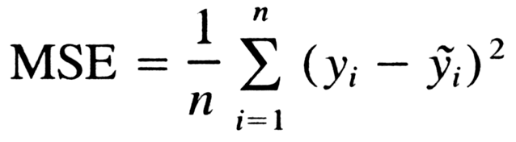

# Machine Learning

> Arthur Samuel described it as: "the field of study that gives computers the ability to learn without being explicitly programmed."


##### Machine learning algorithms classify into two groups :

    1. Supervised Learning
    2. Unsupervised Learning

<hr>

## Supervised Learning

###### Goal :

    Predict class or value label

###### Defination :

> Basically supervised learning is a learning in which we teach or train the machine using data which is well labeled that means some data is already tagged with the correct answer.

##### Supervised learning classified into two categories of algorithms :

    1. Regression
    2. Classification


### Regression

###### Defination :

> In statistical modeling, regression analysis is a set of statistical processes for estimating the relationships between a dependent variable and one or more independent variables.The output variable in regression is numerical (or continuous).

###### Example :

    Given a picture of a person, we have to predict their age on the basis of the given picture

#### Basics


##### Explain :

- **The purple dots** are the points(Original points) on the graph. Each point has an x-coordinate and a y-coordinate.

- **The blue line** is our prediction line(we just assume a prediction line). This line contains the predicted points.

- **The red line** between each purple point and the prediction line are the errors. Each error is the distance from the point to its predicted point.

###### The prediction equation is :

     y=Mx+B, where M is the slope of the line and B is y-intercept of the line.

###### Sum of Square Regression :

> 

    Where:

    1. ŷi – the value estimated by the regression line

    2. ȳ (y bar) – the mean value of a sample

> The **regression sum of squares** describes how well a regression model represents the modeled data. A **higher** regression sum of squares indicates that the model **does not fit** the data well.

###### Total sum of squares :

> 

    Where:

    1. Yi – the value in a sample

    2. ȳ (y bar) – the mean value of a sample

> The total sum of squares quantifies the total variation in a sample.

##### Mean Squared Error (MSE) or Mean squared Deviation (MSD) :

###### General formula for mean squared error:

> 

##### R-Squared :

> r-squared shows how well the data fit the regression model (the goodness of fit).

###### Formula :

> 

    Where:
        1. SS(regression) is the sum of squares due to regression (explained sum of squares)
        2. SS(total) is the total sum of squares

> In the **best case**, the modeled values exactly match the observed values, which results in **SSR = 0** and **R-Squared = 1**. A **baseline model**, which always **predicts ȳ** , will have **R-Squared = 0**, Models that have **worse predictions** than this baseline will have a **negative R-Squared**.

##### Problems with R-squared

> R-squared increases every time you add an independent variable to the model. The R-squared never decreases, not even when it’s just a chance correlation between variables. A regression model that contains more independent variables than another model can look like it provides a better fit merely because it contains more variables.

##### Adjusted R-Squared :

> Adjusted R-squared is used to compare the goodness-of-fit for regression models that contain differing numbers of independent variables.

> 

    n = the sample size

    k = the number of independent variables in the regression equation

##### Cost Function :

##### Gradient Decent :

##### Machine Learning Regression models:

      1. Simple Linear Regression
      2. Multiple Linear Regression
      3. Polynomial Regression
      4. Support Vector for Regression (SVR)
      5. Decision Tree Regression
      6. Random Forest Regression

#### Linear Regression

> Linear regression is a statistical approach for modelling relationship between a dependent variable with a given set of independent variables.

#### Simple Linear Regression

> Simple linear regression is an approach for predicting a response (dependent variables) using a single feature(independent variable).

###### The formula for a simple linear regression is:

    y = βo + β*x

    here,
       1. y is the predicted value or the dependent variable for any given value of the independent variable (x).
       2. βo is the intercept, the predicted value of y when the x is 0.
       3. β is the regression coefficient – how much we expect y to change as x increases.
       4. x is the independent variable ( the variable we expect is influencing y).

[Code In Jupyter Nodebook](Regression/Simple%20Linear%20Regrassion/simple%20linear%20regression.ipynb)

#### Multiple Linear Regression

[Code In Jupyter Nodebook](Regression/Multiple%20Linear%20Regression/multiple%20linear%20regression.ipynb)

##### There are various ways to build a model in Machine Learning, which are:

1. All-in
2. Backward Elimination
3. Forward Selection
4. Bidirectional Elimination
5. Score Comparison

##### Backward Elimination

> Backward elimination is a feature selection technique while building a machine learning model. It is used to remove those features that do not have a significant effect on the dependent variable or prediction of output.

###### Steps of Backward Elimination

    Step-1: Firstly, We need to select a significance level to stay in the model. (SL=0.05)

    Step-2: Fit the complete model with all possible predictors/independent variables.

    Step-3: Choose the predictor which has the highest P-value, such that.

    If P-value >SL, go to step 4.
    Else Finish, and Our model is ready.
    Step-4: Remove that predictor.

    Step-5: Rebuild and fit the model with the remaining variables.

###### Backward Elimination with p-values only:

```py

import statsmodels.formula.api as sm
def backwardElimination(x, sl):
    numVars = len(x[0])
    for i in range(0, numVars):
        regressor_OLS = sm.OLS(y, x).fit()
        maxVar = max(regressor_OLS.pvalues).astype(float)
        if maxVar > sl:
            for j in range(0, numVars - i):
                if (regressor_OLS.pvalues[j].astype(float) == maxVar):
                    x = np.delete(x, j, 1)
    regressor_OLS.summary()
    return x

SL = 0.05
X_opt = X[:, [0, 1, 2, 3, 4, 5]]
X_Modeled = backwardElimination(X_opt, SL)

```

###### Backward Elimination with p-values and Adjusted R Squared:

```py

import statsmodels.formula.api as sm
def backwardElimination(x, SL):
    numVars = len(x[0])
    temp = np.zeros((50,6)).astype(int)
    for i in range(0, numVars):
        regressor_OLS = sm.OLS(y, x).fit()
        maxVar = max(regressor_OLS.pvalues).astype(float)
        adjR_before = regressor_OLS.rsquared_adj.astype(float)
        if maxVar > SL:
            for j in range(0, numVars - i):
                if (regressor_OLS.pvalues[j].astype(float) == maxVar):
                    temp[:,j] = x[:, j]
                    x = np.delete(x, j, 1)
                    tmp_regressor = sm.OLS(y, x).fit()
                    adjR_after = tmp_regressor.rsquared_adj.astype(float)
                    if (adjR_before >= adjR_after):
                        x_rollback = np.hstack((x, temp[:,[0,j]]))
                        x_rollback = np.delete(x_rollback, j, 1)
                        print (regressor_OLS.summary())
                        return x_rollback
                    else:
                        continue
    regressor_OLS.summary()
    return x

SL = 0.05
X_opt = X[:, [0, 1, 2, 3, 4, 5]]
X_Modeled = backwardElimination(X_opt, SL)

```


Now let us have a brief look at the parameters of the OLS summary.

- **R square** – It tells about the goodness of the fit. It ranges between 0 and 1. The closer the value to 1, the better it is. It explains the extent of variation of the dependent variables in the model. However, it is biased in a way that it never decreases(even on adding variables).

- **Adj Rsquare** – This parameter has a penalising factor(the no. of regressors) and it always decreases or stays identical to the previous value as the number of independent variables increases. If its value keeps increasing on removing the unnecessary parameters go ahead with the model or stop and revert.

- **F statistic** – It is used to compare two variances and is always greater than 0. It is formulated as v12/v22. In regression, it is the ratio of the explained to the unexplained variance of the model.

- **AIC and BIC** – AIC stands for Akaike’s information criterion and BIC stands for Bayesian information criterion Both these parameters depend on the likelihood function L.

- **Skew** – Informs about the data symmetry about the mean.

- **Kurtosis** – It measures the shape of the distribution i.e.the amount of data close to the mean than far away from the mean.

- **Omnibus** – D’Angostino’s test. It provides a combined statistical test for the presence of skewness and kurtosis.

- **Log-likelihood** – It is the log of the likelihood function.


This image shows the preferred relative values of the parameters.

[Backward Elimination with p-values only Implementation](Regression/Multiple%20Linear%20Regression/backword_elimination.ipynb)

[Backward Elimination with p-values and Adjusted R Squared in NoteBook](Regression/Multiple%20Linear%20Regression/Backward%20Elimination%20with%20p-values%20and%20Adjusted%20R%20Squared.ipynb)

#### Polinomial Regression

> Polynomial Regression is a form of linear regression in which the relationship between the independent variable x and dependent variable y is modeled as an nth degree polynomial. Polynomial regression fits a nonlinear relationship between the value of x and the corresponding conditional mean of y, denoted E(y |x)

###### The formula for a Polynomial regression is:

    y = a + b1x + b2x^2 +....+ bnx^n

[Implementation of Polynomial Regression (Python) in Jupyter Notebook](Regression/Polynomial%20Regression/polynomial_regression.ipynb)

#### SVR (Support Vector Regression) : SVR is a bit different from SVM

> In simple regression we try to minimise the error rate. While in SVR we try to fit the error within a certain threshold.

##### The terms that we need most :

- **Kernel**: The function used to map a lower dimensional data into a higher dimensional data.
- **Hyper Plane:** In SVM this is basically the separation line between the data classes. Although in SVR we are going to define it as the line that will will help us predict the continuous value or target value
- **Boundary line:** In SVM there are two lines other than Hyper Plane which creates a margin . The support vectors can be on the Boundary lines or outside it. This boundary line separates the two classes. In SVR the concept is same.
- **Support vectors:** This are the data points which are closest to the boundary. The distance of the points is minimum or least.

###### SVR MODEL :


###### Assuming that the equation of the hyperplane is as follows:

    Y = wx+b (equation of hyperplane)

###### Then the equations of decision boundary become:

    wx+b= +a
    wx+b= -a

###### Thus, any hyperplane that satisfies our SVR should satisfy:

    -a < Y- wx+b < +a

> Our main aim here is to decide a decision boundary at ‘a’ distance from the original hyperplane such that data points closest to the hyperplane or the support vectors are within that boundary line.

[Medium : Support Vector Regression Or SVR](https://medium.com/coinmonks/support-vector-regression-or-svr-8eb3acf6d0ff)

[About SVM Kernels](<https://data-flair.training/blogs/svm-kernel-functions/#:~:text=SVM%20algorithms%20use%20a%20set,it%20into%20the%20required%20form.&text=These%20functions%20can%20be%20different,(RBF)%2C%20and%20sigmoid.>)

[Implementing Support Vector Regression (SVR) in Python Jupyter Notebook](<Regression/Support%20Vector%20Regression%20(SVR)/svr.ipynb>)

#### Decession Tree Regression

> Decision tree builds regression or classification models in the form of a tree structure. It breaks down a dataset into smaller and smaller subsets while at the same time an associated decision tree is incrementally developed. The final result is a tree with decision nodes and leaf nodes

##### Decision Tree Algorithm

> The core algorithm for building decision trees called ID3 by J. R. Quinlan which employs a top-down, greedy search through the space of possible branches with no backtracking. The ID3 algorithm can be used to construct a decision tree for regression by replacing Information Gain with Standard Deviation Reduction.

##### ⭕️ Important Terminology :

- **Root Node:** It represents entire population or sample and this further gets divided into two or more homogeneous sets.
- **Splitting:** It is a process of dividing a node into two or more sub-nodes.
- **Decision Node:** When a sub-node splits into further sub-nodes, then it is called decision node.
- **Leaf/Terminal Node:** Nodes do not split is called Leaf or Terminal node.
- **Pruning:** When we remove sub-nodes of a decision node, this process is called pruning. You can say opposite process of splitting.
- **Branch / Sub-Tree:** A sub section of entire tree is called branch or sub-tree.
- **Parent and Child Node:** A node, which is divided into sub-nodes is called parent node of sub-nodes whereas sub-nodes are the child of parent node.


###### Example :


###### Cheat Sheet


[Code in Notebook](Regression/Decession%20Tree%20Regression/decision%20tree.ipynb)

[Decession Tree in Medium](<https://medium.com/greyatom/decision-trees-a-simple-way-to-visualize-a-decision-dc506a403aeb#:~:text=A%20decision%20tree%20is%20a%20flowchart%2Dlike%20structure%20in%20which,taken%20after%20computing%20all%20attributes).>)

[Best Article On Decision Tree Regression](https://gdcoder.com/decision-tree-regressor-explained-in-depth/)

###### Problems with Decision Trees :(

> Decision trees are sensitive to the specific data on which they are trained. If the training data is changed the resulting decision tree can be quite different and in turn the predictions can be quite different.
> Also Decision trees are computationally expensive to train, carry a big risk of **overfitting**, and tend to find local optima because they can’t go back after they have made a split.
> To address these weaknesses, we turn to **Random Forest** :) which illustrates the power of combining many decision trees into one model.

#### Random Forest Regression

> A **Random Forest** is an **ensemble** technique capable of performing both **regression** and **classification** tasks with the use of multiple decision trees and a technique called **Bootstrap** and **Aggregation**, commonly known as **bagging**. The basic idea behind this is to combine **multiple decision trees** in determining the final output rather than relying on individual decision trees.

##### Ensemble Learning

> An Ensemble method is a technique that combines the predictions from multiple machine learning algorithms together to make more accurate predictions than any individual model. A model comprised of many models is called an Ensemble model.


##### Types of Ensemble Learning:

    1. Boosting.
    2. Bootstrap Aggregation (Bagging).

> **Boosting** refers to a group of algorithms that utilize weighted averages to make weak learners into stronger learners. Boosting is all about “teamwork”.In boosting as the name suggests, one is learning from other which in turn boosts the learning.

> **Bootstrap** refers to random sampling with replacement. Bootstrap allows us to better understand the **bias** and the **variance** with the dataset. Bootstrap involves random sampling of small subset of data from the dataset. **Bagging** makes each model run **independently** and then aggregates the outputs at the end without preference to any model.

**Random forest is a bagging technique and not a boosting technique. The trees in random forests are run in parallel. There is no interaction between these trees while building the trees.**

> It operates by constructing a multitude of decision trees at training time and outputting the class that is the **mode of the classes** (classification) or **mean prediction** (regression) of the individual trees.

###### Random Forest Tree Structre :


###### Feature and Advantages of Random Forest :

    1. It is one of the most accurate learning algorithms available. For many data sets, it produces a highly accurate classifier.
    2. It runs efficiently on large databases.
    3. It can handle thousands of input variables without variable deletion.
    4. It gives estimates of what variables that are important in the classification.
    5. It generates an internal unbiased estimate of the generalization error as the forest building progresses.
    6. It has an effective method for estimating missing data and maintains accuracy when a large proportion of the data are missing.

###### Disadvantages of Random Forest :

    1. Random forests have been observed to overfit for some datasets with noisy classification/regression tasks.

    2. For data including categorical variables with different number of levels, random forests are biased in favor of those attributes with more levels.
    Therefore, the variable importance scores from random forest are not reliable for this type of data.

[Code in Jupyter Notebook](Regression/Random%20Forest%20Regression/random_forest_regression.ipynb)

<hr>

## UnSupervised Learning

###### Goal :

    Determine data patterns/groupings

###### Defination :

> Unsupervised learning is the training of machine using information that is neither classified nor labeled and allowing the algorithm to act on that information without guidance. Here the task of machine is to group unsorted information according to similarities, patterns and differences without any prior training of data.

###### Example :

    Suppose it is given an image having both dogs and cats which have not seen ever.
    Thus the machine has no idea about the features of dogs and cats so we can’t categorize it in dogs and cats.
    But it can categorize them according to their similarities, patterns, and differences i.e., we can easily categorize the above picture into two parts.
    First first may contain all pics having dogs in it and second part may contain all pics having cats in it.

##### Unsupervised learning classified into two categories of algorithms

    1. Clustering
    2. Association

### Clustering

##### Clustering Types

    1. Hierarchical clustering
    2. K-means clustering
    3. K-NN (k nearest neighbors)
    4. Principal Component Analysis
    5. Singular Value Decomposition
    6. Independent Component Analysis


[NEXT](ml2.md)