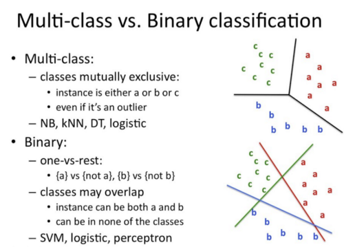

## Classification

> Classification is the problem of identifying to which of a set of categories (sub populations), a new observation belongs to, on the basis of a training set of data containing observations and whose categories membership is known.

###### Classification Use Cases

    1. Spam E-mail filtering is one of the most widespread and well recognized uses of Classification techniques.
    2. To identify customer segments
    3. To find if a bank loan is granted
    4. To identify if a kid will pass or fail in an examination
    5. Google’s self driving car uses deep learning enabled classification techniques which enables it to detect and classify obstacles
    6. Detecting Health Problems
    7. Facial Recognition
    8. Speech Recognition
    9. Object Detection
    10. Sentiment Analysis

#### Classification is of two types:

    1. Binary Classification
    2. Multiclass Classification

##### Binary Classification :

> When we have to categorize given data into 2 distinct classes. Example – On the basis of given health conditions of a person, we have to determine whether the person has a certain disease or not.

##### Multiclass Classification :

> The number of classes is more than 2. For Example – On the basis of data about different species of flowers, we have to determine which specie does our observation belong to.

##### Types of Classification Algorithms

1. Linear Models

   - Logistic Regression
   - Support Vector Machines

2. Nonlinear models

   - K-nearest Neighbors (KNN)
   - Kernel Support Vector Machines (SVM)
   - Bayesian Regression
   - Gaussian Naïve Bayes
   - Decision Tree Classification
   - Artificial Neural Networks (ANN)
   - Stochastic Gradient Descent (SGD) Classifier

3. Ensemble Methods

   - Random Forests Classification
   - AdaBoost
   - Bagging Classifier
   - Voting Classifier
   - ExtraTrees Classifier

### Logistic Regression

##### Types of Logistic Regression :

   1. Binary Logistic Regression
      The categorical response has only two 2 possible outcomes. Example: Spam or Not
   2. Multinomial Logistic Regression
      Three or more categories without ordering. Example: Predicting which food is preferred more (Veg, Non-Veg, Vegan)
   3. Ordinal Logistic Regression
      Three or more categories with ordering. Example: Movie rating from 1 to 5

Decision Boundary

[logistic-regression-python funtion usages](https://realpython.com/logistic-regression-python/)

